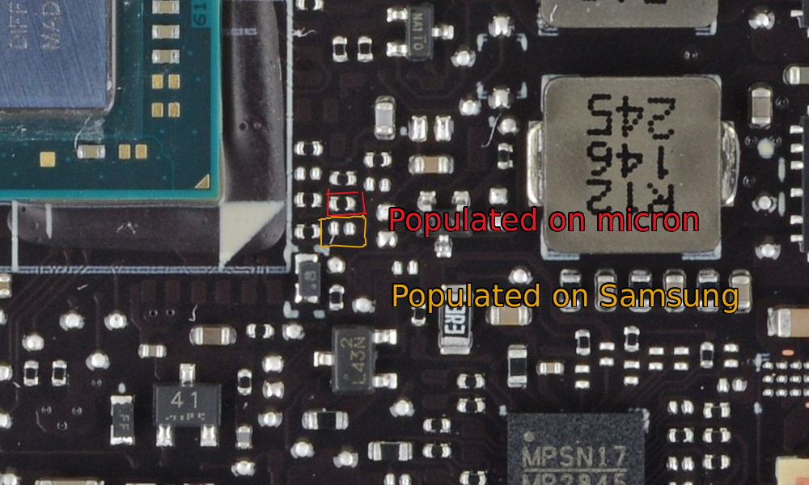
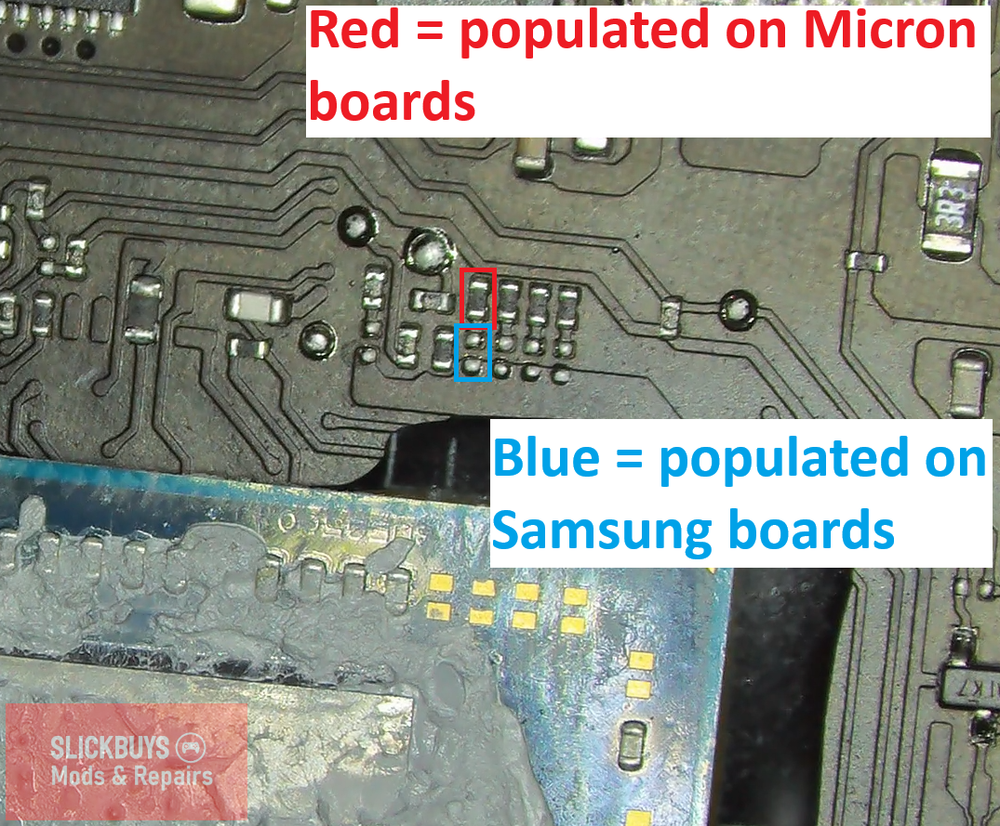
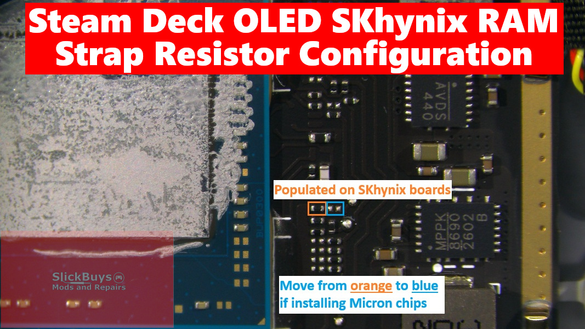

# Memory / RAM Upgrade

## [Video Explaining The Process (by dosdude1)](https://www.youtube.com/watch?v=nmobr6YEhWE)

## [Difference Between 16GB (Stock) Vs 32GB (modded) Steam Deck Performance (by Specter)](https://www.youtube.com/watch?v=yr_xtTxmBdo)

## Requirements
- Knowledge about BGA soldering
- Proper tools for BGA soldering
- BIOS Patch:
    - LCD
        - Available in Steam Deck Discord
        - [Balika011's site (DeckHD + 32GB combination too)](http://balika011.hu/deck_32gb/)
    - OLED
        - Available in Steam Deck Discord

### LCD Steam Deck
- For now, people only do 32GB
- 48GB might be possible?
- Tested Modules:
    - Samsung 8GB LPDDR5X K3LKCKC0BM-MGCP (x4)

#### LCD Strap Resistor Configuration (Balika011)

### OLED Steam Deck
- Modding to 32GB is now possible!
    - [Slickbuys Mods and Repairs video about it](https://www.youtube.com/watch?v=9qvP_lOP48M)
- Tested Modules:
    - Micron 16GB MT62F2G64D8AJ LPDDR5 (x2)

#### OLED Strap Resistor Configuration (Slickbuys Mods And Repairs)

